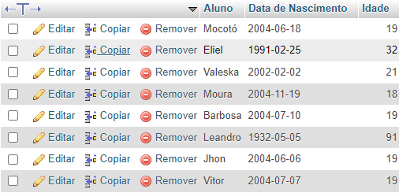

# Desafios

## Criar uma consulta que calcule a idade do aluno
```SQL
SELECT 
nome Aluno,
nascimento "Data de Nascimento",
TIMESTAMPDIFF(YEAR, nascimento, NOW()) Idade
FROM alunos
```


## Criar uma consulta que calcule a média das notas de cada aluno e mostre somente os alunos que tiveram a média maior ou igual a 7.

```SQL

```