# Etapa 3

## 1) Faça uma consulta que mostre os alunos que nasceram antes do ano 2009

```SQL
SELECT nome "Alunos", nascimento "Data de Nascimento" FROM alunos WHERE nascimento <= "2009-01-01"
ORDER BY nascimento;
```

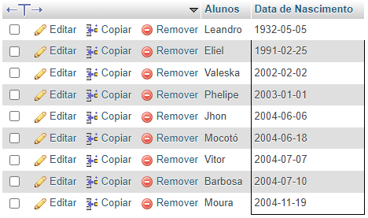

## 2) Faça uma consulta que calcule a média das notas de cada aluno e as mostre com duas casas decimais.


```SQL
SELECT nota1 "Nota 1", nota2 "Nota 2", nome Alunos, CAST(((nota1 + nota2) / 2) AS DEC(6,2)) Média FROM alunos;
```

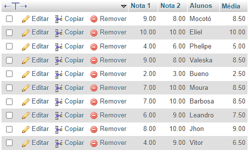

## 3) Faça uma consulta que calcule o limite de faltas de cada curso de acordo com a carga horária. Considere o limite como 25% da carga horária. Classifique em ordem crescente pelo título do curso.

```SQL
SELECT titulo "Cursos", cargaHoraria "Carga Horária", ROUND(cargaHoraria / 4, 0) "Limite de Faltas" FROM cursos 
```

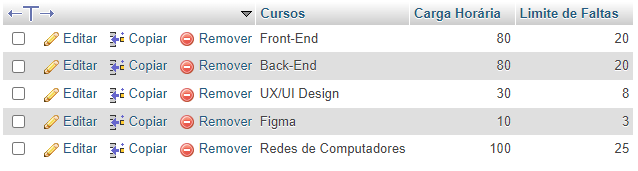

## 4) Faça uma consulta que mostre os nomes dos professores que são somente da área "desenvolvimento".

```SQL
SELECT nome Professores, atuacao "Atuação" FROM professores WHERE atuacao = 2
```

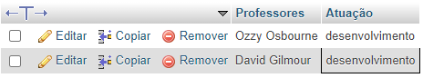

## 5) Faça uma consulta que mostre a quantidade de professores que cada área ("design", "infra", "desenvolvimento") possui.

```SQL
SELECT atuacao "Atuação", COUNT(*) "Qtd Atuações" FROM professores 
GROUP BY atuacao
```

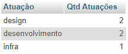

## 6) Faça uma consulta que mostre o nome dos alunos, o título e a carga horária dos cursos que fazem.

```SQL
SELECT 
alunos.nome Alunos, 
cursos.titulo Cursos, 
cursos.cargaHoraria "Carga Horária" 
FROM alunos INNER JOIN cursos
ON alunos.curso_id = cursos.id
```

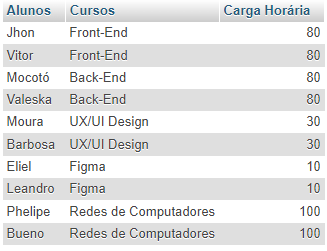

## 7) Faça uma consulta que mostre o nome dos professores e o título do curso que lecionam. Classifique pelo nome do professor.

```SQL
SELECT 
professores.nome Professores, 
cursos.titulo Cursos
FROM professores INNER JOIN cursos
ON professores.curso_id = cursos.id
```

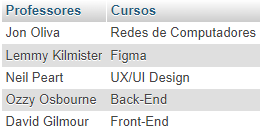

## 8) Faça uma consulta que mostre o nome dos alunos, o título dos cursos que fazem, e o professor de cada curso.

```SQL
SELECT 
alunos.nome Alunos, 
cursos.titulo Cursos, 
professores.nome Professores 
FROM alunos 
INNER JOIN cursos ON cursos.id = alunos.curso_id
INNER JOIN professores ON cursos.id = professores.curso_id
```


## 9) Faça uma consulta que mostre a quantidade de alunos que cada curso possui. Classifique os resultados em ordem descrecente de acordo com a quantidade de alunos.

```SQL
SELECT 
cursos.titulo "Nome do Curso",
COUNT(alunos.id) "Qtd alunos" 
FROM cursos INNER JOIN alunos
ON cursos.id = alunos.curso_id 
GROUP BY cursos.titulo
ORDER BY COUNT(alunos.id) DESC;  
```

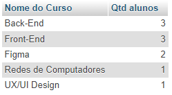

## 10) Faça uma consulta que mostre o nome dos alunos, suas notas, médias, e o título dos cursos que fazem. Devem ser considerados somente os alunos de Front-End e Back-End. Mostre os resultados classificados pelo nome do aluno.

```SQL
SELECT 
alunos.nome Alunos,
alunos.nota1 "Nota 1",
alunos.nota2 "Nota 2",
CAST(((alunos.nota1 + alunos.nota2) / 2) AS DEC(6,2)) "Média",
cursos.titulo Curso
FROM alunos INNER JOIN cursos
ON cursos.id = alunos.curso_id
WHERE cursos.id = 1 OR cursos.id = 2
```

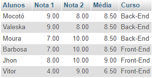

## 11) Faça uma consulta que altere o nome do curso de Figma para Adobe XD e sua carga horária de 10 para 15.

```SQL
UPDATE cursos SET titulo = 'Adobe XD'
WHERE id = 4;
UPDATE cursos SET cargaHoraria = 15
WHERE id = 4;
```

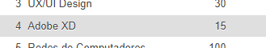

## 12) Faça uma consulta que exclua um aluno do curso de Redes de Computadores e um aluno do curso de UX/UI.

```SQL
DELETE FROM alunos WHERE id = 3;
DELETE FROM alunos WHERE id = 5;
```
### Antes
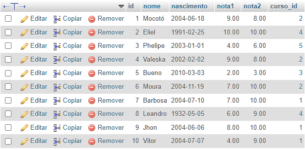
### Depois
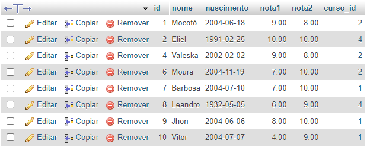

## 13) Faça uma consulta que mostre a lista de alunos atualizada e o título dos cursos que fazem, classificados pelo nome do aluno.

```SQL
SELECT 
alunos.nome Alunos,
cursos.titulos Cursos,
FROM alunos INNER JOIN cursos
ON cursos.id = alunos.curso_id
ORDER BY nome
```

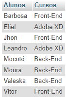